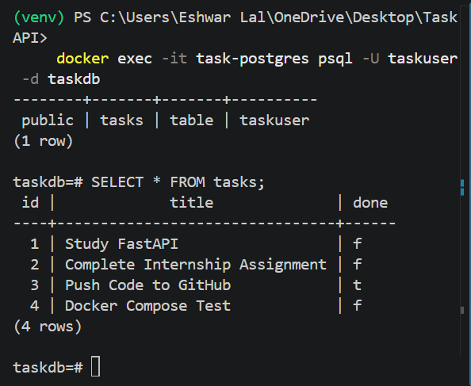

# Task API with PostgreSQL & Docker

A simple REST API built with **FastAPI**, **PostgreSQL**, and **Docker** for managing tasks.

The application uses PostgreSQL as the database and Docker Compose to create and manage the database container automatically.

---

## Why PostgreSQL?

- Open-source relational database
- Reliable and scalable
- Supports SQL standards
- Works well with Docker
- Suitable for production applications

---
## Technologies Used

- Python 3.10
- FastAPI
- PostgreSQL
- Docker
- Docker Compose
- Psycopg
- Pydantic
- Python Dotenv
- Uvicorn

---

## Features

- Create Task
- Get All Tasks
- Get Task by ID
- Update Task
- Delete Task
- PostgreSQL Database Storage
- Docker Compose Support
- Automatic Database Creation
- Automatic Table Creation
- Seed Initial Tasks
- Swagger UI

---

## Database

Database configuration

```text
Database Name : taskdb
User          : taskuser
Container     : task-postgres
Port          : 5432
```

The database and tables are created automatically when the application starts.

---

## Installation

Clone the repository

```bash
git clone <repository-url>
```

Move into the project

```bash
cd TaskAPI
```

Create a virtual environment

```bash
python -m venv venv
```

Activate the environment

Windows

```bash
venv\Scripts\activate
```

Install dependencies

```bash
pip install -r requirements.txt
```

Create a `.env` file using `.env.example`.

Start PostgreSQL

```bash
docker compose up -d
```

Run the FastAPI server

```bash
uvicorn main:app --reload
```
---
## Swagger UI

Open

```
http://127.0.0.1:8000/docs
```

---

## API Endpoints

| Method | Endpoint | Description |
|---------|----------|-------------|
| GET | / | API Information |
| GET | /health | Health Check |
| GET | /tasks | Get All Tasks |
| GET | /tasks/{task_id} | Get Task by ID |
| POST | /tasks | Create Task |
| PUT | /tasks/{task_id} | Update Task |
| DELETE | /tasks/{task_id} | Delete Task |

---

## Example SQL Query

```sql
SELECT * FROM tasks;
```

This query returns all tasks stored in the PostgreSQL database.

---


## Project Structure

```text
TaskAPI/
│
├── main.py
├── docker-compose.yml
├── .env.example
├── requirements.txt
├── README.md
├── .gitignore
└── screenshots/
```
## Database Screenshot



---
## Start PostgreSQL

```bash
docker compose up -d
```

Stop

```bash
docker compose down
```

---

## Author

**Eshwar Lal**  
Backend Development Intern