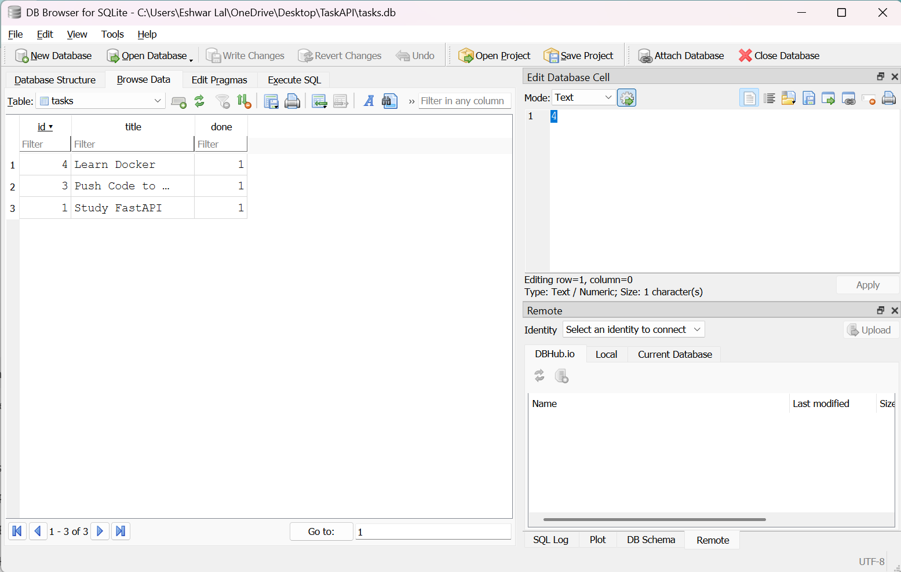

# Task API with SQLite

A simple REST API built with **FastAPI** and **SQLite** for managing tasks.  
This project stores tasks in a SQLite database, so the data remains available even after restarting the server.

---

## Why SQLite?

SQLite was chosen because:

- It is lightweight and serverless.
- No database server installation is required.
- Stores all data in a single file.
- Data persists after server restarts.
- Perfect for beginner backend projects.

---

## Technologies Used

- Python 3.10
- FastAPI
- SQLite
- sqlite3
- Uvicorn
- Pydantic

---

## Features

- Create Task
- Get All Tasks
- Get Task by ID
- Update Task
- Delete Task
- SQLite Database Storage
- Automatic Database Creation
- Automatic Table Creation
- Seed Initial Tasks
- Swagger UI

---

## Database

The application automatically creates

```
tasks.db
```

when the server starts if it does not already exist.

No manual database setup is required.

---

## Installation

Clone the repository

```bash
git clone <repository-url>
```

Move into the project

```bash
cd task-api-fastapi
```

Install dependencies

```bash
pip install -r requirements.txt
```

Run the application

```bash
uvicorn main:app --reload
```

---

## Swagger UI

Open

```
http://127.0.0.1:8000/docs
```

---

## API Endpoints

| Method | Endpoint | Description |
|---------|----------|-------------|
| GET | / | API Information |
| GET | /health | Health Check |
| GET | /tasks | Get All Tasks |
| GET | /tasks/{task_id} | Get Task by ID |
| POST | /tasks | Create Task |
| PUT | /tasks/{task_id} | Update Task |
| DELETE | /tasks/{task_id} | Delete Task |

---

## Example SQL Query

```sql
SELECT * FROM tasks;
```

This query returns all tasks stored in the SQLite database.

---

## Database Screenshot

Add your DB Browser screenshot here.

Example:

```
screenshots/database.png
```

```markdown

```

---

## Project Structure

```
TaskAPI/
│── main.py
│── tasks.db
│── requirements.txt
│── README.md
│── .gitignore
```

---

## Author

**Eshwar Lal**
Backend Development Intern